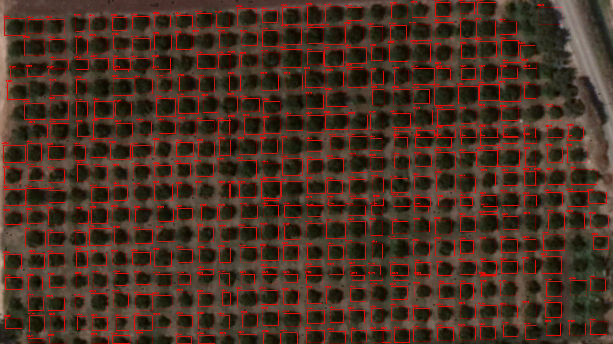
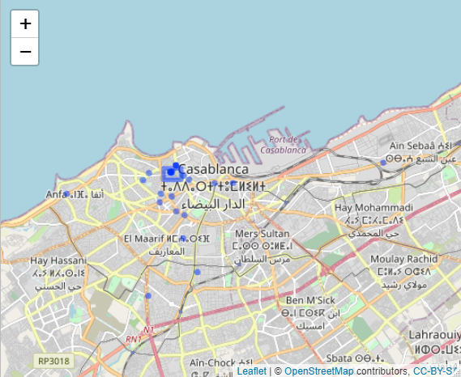
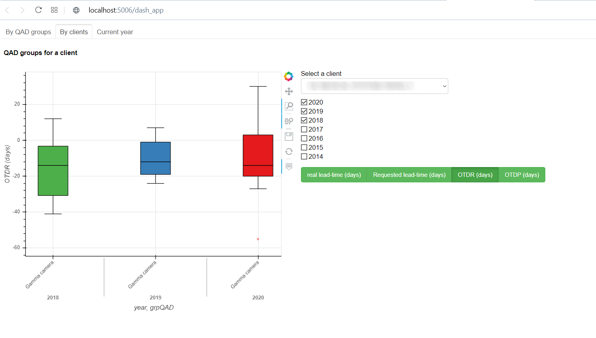

# Mehdi_portfolio
Mehdi EL HAYLALI's data science portfolio

# Citrus Trees Detection on satellite images
  

**Tools & Techniques** : Yolo, GPU, Satellite images from Google Earth, OpenCV for image processing.

# Classification of movie reviews using artificial neural networks
Classifying movie reviews as positive or negative, based on the text content of the reviews.

# [Detecting home location of Heetch app's drivers using spatial data analysis techniques with R.](http://rpubs.com/MHD/HomeLocationDetection_Rproject)
   

**Tools & Techniques** : R (leaflet, sf, st), Spatial data processing techniques, GPS data. 

# Data streaming from twitter API
Extracting, processing and real-time visualization of data related to a hashtag along with performing NLP techniques using SpaCy.

# On-Time Delivery Dashboard  

