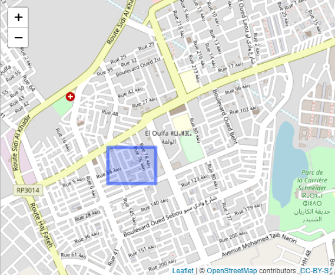

# Mehdi_portfolio
Mehdi EL HAYLALI's data science portfolio
# Citrus Trees Detection on satellite images

# Classification of movie reviews using artificial neural networks
Classifying movie reviews as positive or negative, based on the text content of the reviews.

# [Detecting home location of Heetch app's drivers using spatial data analysis techniques with R.](https://rpubs.com/MHD/705796)

# Data streaming from twitter API
Extracting, processing and real-time visualization of data related to a hashtag along with performing NLP techniques using SpaCy.

# On-Time Delivery Dashboard
