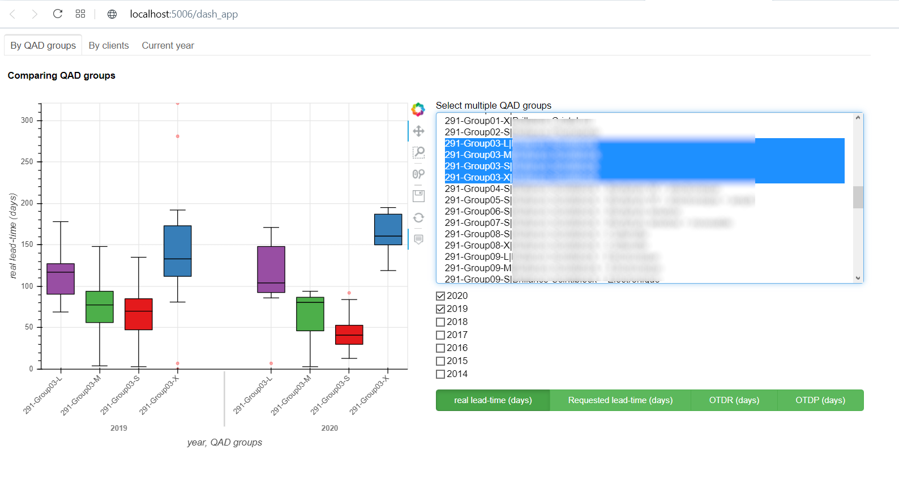
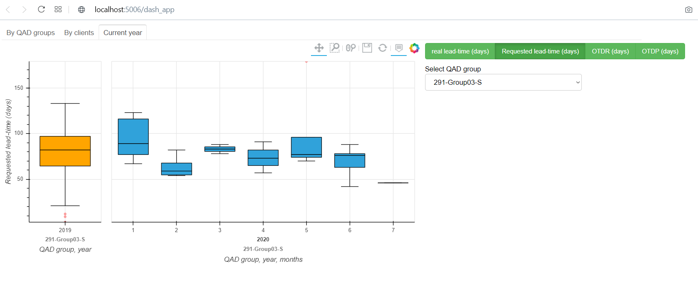

# Data Science Portfolio - Mr. Mehdi EL HAYLALI
This page presents the main projects I worked on until now.

# Citrus Trees Detection on Satellite Images  
As an R&D intern at the "Moroccan Foundation for Advanced Science, Innovation and Research", I worked on Citrus Trees Detection on Satellite Images. I started by conducting scientific literature review on the subject, then I selected one of the state-of-the-art techniques I read about in the review in order to test it. The approach was promissing and resulted in writting a [scientific paper](/images/article_ElHaylali.pdf).

<kbd></kbd>

**Tools & Techniques** : Convolutional Neural Network (CNN), Yolo, GPU, Satellite images from Google Earth, Python's OpenCV for image processing.

# [Detecting Home Location of Heetch App's Drivers based on their Digital Footprint.](http://rpubs.com/MHD/HomeLocationDetection_Rproject)
<kbd></kbd>

**Tools & Techniques** : R (leaflet, sf, st), Spatial data processing techniques, GPS data. 

# On-Time Delivery Dashboard  
As an intern at a manufacturing company, I created this interactive dashboard for the management in order to better understand and monitor its behavior in terms of production lead-times and delays incurred by customers. This dashboard helps especially the customer service department offer more accurate delivery dates for customers. It also alerts the production department about product lines having unusual lead-times.
The visualized variables : actual production lead-time, lead-time requested by customers, delay from due delivery date, delay from requested delivery date. 

### Tab 1 : viewing lead-time and delay by product categories
<kbd></kbd>

### Tab 2 : viewing lead-time and delay by customers
<kbd></kbd>

### Tab 3 : viewing lead-time and delay for the months of current year
<kbd></kbd> 

**Tools & Techniques** : Python, Pandas, Bokeh, Holoviews, Panel.

# Data streaming from twitter API
Extracting, processing and real-time visualization of data related to a hashtag along with performing NLP techniques using SpaCy.

**Tools & Techniques** : Python, Pandas, NLP with SpaCy, Twitter API, ETL paradigm.

# Classification of movie reviews using artificial neural networks
Classifying movie reviews as positive or negative, based on the text content of the reviews.

**Tools & Techniques**: Python, Keras.
